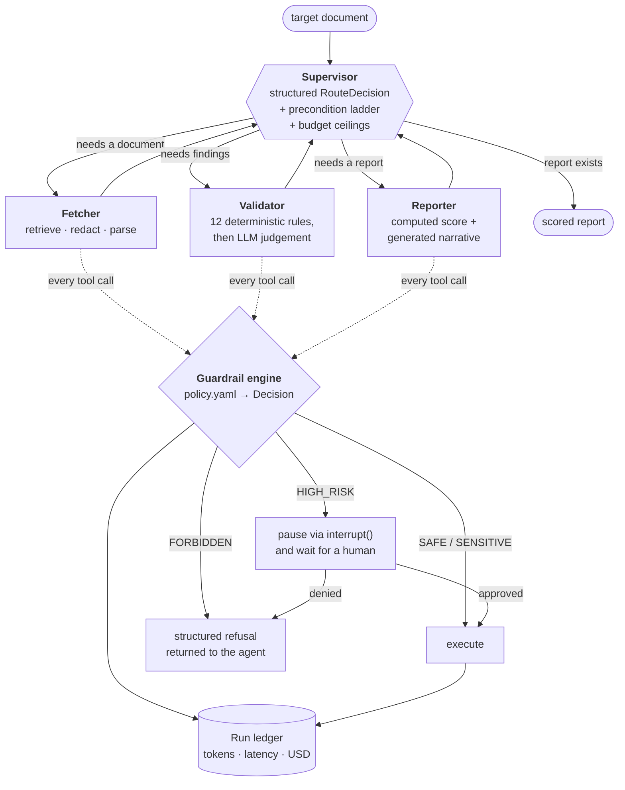

# Multi-Agent API Documentation Evaluator

A supervisor-routed multi-agent system that evaluates OpenAPI documents and produces a scored,
actionable report — built around a **tiered guardrail layer** where risk is a property of the
call rather than of the tool, and a **per-run cost ledger** that prices every model call and
times policy evaluation as its own span.

It runs with **no API key**. A replay model derives answers from the same structured prompt
context the live model reads, so the whole graph — routing, guardrails, scoring, the UI and the
benchmark — exercises real logic offline. Set `ANTHROPIC_API_KEY` and the same code paths run
against Claude.

```bash
pip install -e ".[dev,ui]"
python -m doc_evaluator.cli --target fixtures/specs/legacy_billing.yaml --mock
streamlit run ui/app.py
```

---

## Architecture



**Star topology, one router.** Workers never choose the next node. A worker that routes is a
second supervisor, and two routers quietly disagreeing is a class of bug that is very hard to
see in a trace.

**The model proposes, code disposes.** The supervisor asks for a `RouteDecision` via structured
output, then a deterministic precondition ladder decides whether that move is legal — you cannot
validate a document that has not been fetched, and you cannot re-dispatch a worker that already
succeeded. Every hop is logged with its provenance (`model` / `precondition` / `budget` /
`completion`), so the routing tab shows not just what ran but who decided.

---

## The guardrail layer

Every tool call passes through one chokepoint. Workers hold a registry, not a function
reference, so "can a tool run without policy evaluation?" has a structural answer rather than a
code-review answer.

| Tier | What happens | Example |
| --- | --- | --- |
| 🟢 `SAFE` | Runs | Fetching an allowlisted spec |
| 🟡 `SENSITIVE` | Runs, audited | Fetching an unknown host; reading a local file |
| 🟠 `HIGH_RISK` | Graph suspends via `interrupt()`, waits for a human | Deleting one cached artifact |
| 🔴 `FORBIDDEN` | Never executes; the agent gets a structured refusal | SSRF, wildcard delete, credential egress |

### Risk is a property of the call, not the tool

This is the design decision the rest follows from. `fetch_document("https://petstore3.swagger.io/…")`
and `fetch_document("http://169.254.169.254/latest/meta-data/")` are the same tool and must not
carry the same tier. A per-tool risk table cannot express that; a predicate over the arguments
can. So `policy.yaml` declares a base tier plus argument-level rules that **escalate** it:

```yaml
fetch_document:
  tier: SAFE
  rules:
    - id: fetch.ssrf
      arg: url
      predicate: private_network_url
      escalate_to: FORBIDDEN
    - id: fetch.off_allowlist
      arg: url
      predicate: url_not_in_allowlist
      escalate_to: SENSITIVE
```

Two properties hold by construction:

- **Deny by default.** An undeclared tool gets `SENSITIVE`, not `SAFE`. Adding a tool without
  thinking about its risk is noisy, not free.
- **Escalation is monotonic.** A rule can raise a tier and never lower it, so you can read any
  single rule and know it cannot be the reason something dangerous got through. That is not true
  of an allow/deny list, where ordering decides the outcome.

### Where the line between "confirm" and "block" sits

The interesting judgement is not *what is dangerous* — it is *what is worth asking a human
about*. A confirmation dialog is a scarce resource: every prompt a person clicks through
without reading makes the next one less effective. So a call is only `HIGH_RISK` if a human
could actually make a better decision than the policy.

- A **bounded** delete (`specs/petstore.json`) is `HIGH_RISK` — recoverable, reviewable, and an
  operator can meaningfully say yes.
- A **wildcard** delete (`*`) is `FORBIDDEN`. This is the one call where an approval prompt is a
  liability: the operator sees a plausible-looking request and clicks yes.
- An outbound POST to an **allowlisted** destination is `HIGH_RISK`.
- An outbound POST whose **destination came from the fetched document** is `FORBIDDEN` — that
  destination is exactly what a prompt injection would try to control, and approving a choice
  made by untrusted input is not a decision a human should be asked to make.
- An outbound POST whose **body carries a credential** is `FORBIDDEN`. Nobody can usefully audit
  that in a dialog box.

### Redaction at the boundary

The fetcher scrubs credentials out of retrieved text *before* any of it reaches a prompt —
provider keys, bearer tokens, JWTs, private-key blocks, and generic `api_key = …` assignments.
The same pattern table backs the credential-egress check, so "don't show the model this" and
"don't let the model send this out" cannot drift apart.

Placeholders are deliberately **not** flagged. Every public OpenAPI example contains
`your_api_key`; if those trip the egress block, the operator learns the dialog is noise. False
positives are the failure mode that kills a guardrail.

### Boring ceilings, non-boring failure mode

Iteration, cumulative-token and wall-clock ceilings are ordinary. What matters is that a tripped
ceiling **degrades rather than raises**: the graph routes to the reporter with whatever findings
exist and stamps a `halt_reason` on the output. Throwing at token 200,001 would discard the work
already paid for.

---

## What the guardrails cost

`python benchmarks/guardrail_overhead.py`

**Direct measurement** — 30,000 timed evaluations across a spread of allowlist hits, escalating
rules and blocked calls:

| Metric | Value |
| --- | ---: |
| Median per evaluation | **22.3 µs** |
| Mean | 26.2 µs |
| p95 | 68.4 µs |
| p99 | 99.4 µs |
| Evaluations per evaluation run | 3 |
| **Policy cost per run** | **0.067 ms** |

**End-to-end A/B** — same graph, same fixtures, policy on vs. off, 30 timed runs per fixture:

| Metric | Guardrails off | Guardrails on | Delta |
| --- | ---: | ---: | ---: |
| Mean end-to-end | 15.06 ms | 13.93 ms | −1.14 ms |
| p50 | 12.90 ms | 12.85 ms | −0.05 ms |
| Tokens per run | 1,665 | 1,665 | +0 |
| Cost per run | $0.01644 | $0.01644 | $0.00000 |

The observed delta sits inside the ±1.48 ms noise band, which is the expected result when the
thing being measured is 0.067 ms. **The honest headline is the direct number: policy evaluation
costs ~22 µs per call and adds no measurable latency or tokens to a run.**

Two methodology notes, because both changed the answer:

- **The benchmark runs in mock mode on purpose.** A live run's latency is dominated by network
  and model variance measured in hundreds of milliseconds; guardrail evaluation is measured in
  microseconds. Replay mode removes that noise so what is left is the overhead being measured.
  `--live` runs the same comparison against the real API when the question is end-to-end
  user-visible latency instead.
- **The two arms are interleaved, not run back to back.** An earlier version ran all of the
  control arm and then all of the treatment arm, and reported a +2.4 ms guardrail cost — 34×
  larger than the direct measurement of the same code. That was drift over the benchmark's
  lifetime landing entirely on one arm and reading as signal. Alternating within each pair
  cancels it, and the two measurements then agree.

---

## Validation

Twelve deterministic rules run first, then the model is asked only about the residue.

**A rule answers it if a machine can answer it exactly** — is `operationId` present, is it
unique, are error responses documented, does a response declare a schema, is a security scheme
declared but never applied, is a path parameter marked required, does an enum have a default.
Cheap, reproducible, and the same document always scores the same.

**The model answers it if it needs reading comprehension** — does the prose explain what the
operation does, or does it restate the path? Its output comes back through a Pydantic schema and
is re-validated before entering state; an LLM response is untrusted input until a schema has
accepted it.

Findings are deduplicated by `(json_path, category)`, not by rule id. The model restates
deterministic findings under its own ids — `llm.no_prose` and `op.no_documentation` are one
observation about one operation — so id-based matching could never catch the overlap.

**The score is computed; only the narrative is generated.** Asking a model for the number would
let two runs over an identical specification disagree, which is disqualifying for an evaluation
tool.

| Fixture | Score | What it demonstrates |
| --- | --- | --- |
| `petstore.json` | 100 / A | A genuinely well-documented API; zero findings |
| `legacy_billing.yaml` | 0 / F | 23 findings, plus a leaked credential that exercises redaction |
| `broken_inventory.json` | 0 / F | Fails the structural contract; critical findings |

---

## Usage

```bash
# Evaluate, offline
python -m doc_evaluator.cli --target fixtures/specs/petstore.json --mock

# See what the policy does with a spread of risky calls
python -m doc_evaluator.cli --demo-risky-tool

# Dump the policy
python -m doc_evaluator.cli --show-policy

# Live, against a real API
export ANTHROPIC_API_KEY=sk-ant-...
python -m doc_evaluator.cli --live \
  --target https://petstore3.swagger.io/api/v3/openapi.json \
  --report out/report.md --ledger out/ledger.json

# UI: routing trace, guardrail audit, cost panel, and the approval dialog
streamlit run ui/app.py

# Tests and benchmark
pytest -q
python benchmarks/guardrail_overhead.py
```

The UI's **guardrail sandbox** is how the approval path is reached: the evaluation pipeline never
calls a `HIGH_RISK` tool, because a documentation evaluator has no business deleting data or
posting to webhooks. The sandbox runs a one-node graph through the same registry, policy and
`interrupt()` cycle, with tool implementations stubbed.

Configuration lives in `.env.example` — model, mode, budget ceilings, and the fetch allowlist.

---

## Layout

```
src/doc_evaluator/
  graph.py          star topology, checkpointer, run driver
  state.py          typed graph state and domain objects
  schemas.py        structured-output contracts for every model call
  samples.py        credential-shaped test values, assembled at runtime
  agents/           supervisor + fetcher / validator / reporter
  guardrails/       engine.py · predicates.py · policy.yaml · redaction.py · budget.py
  observability/    pricing.py · ledger.py · instrument.py
  tools/            registry.py (the chokepoint) · doc_tools.py · risky_tools.py
  validation/       rules.py · meta_schema.py
  llm/              client.py · replay.py · prompt_context.py
ui/app.py           Streamlit front end
benchmarks/         guardrail overhead measurement
tests/              178 tests
```

`docs/architecture.md` covers the design tradeoffs and what was rejected;
`docs/guardrails.md` covers the threat model and what this deliberately does not defend against.

---

## Testing

178 tests, no network and no API key required.

```
tests/test_guardrail_engine.py    tiers, escalation, every predicate, policy load-time validation
tests/test_registry.py            enforcement, approval, refusal contract, instrumentation
tests/test_redaction.py           detection, placeholder tolerance, idempotence
tests/test_validation_rules.py    rule detection, malformed-document robustness, scoring
tests/test_supervisor.py          the precondition ladder and budget ceilings
tests/test_graph.py               end-to-end runs, interrupt/resume both ways, deduplication
tests/test_demo_sandbox.py        every sandbox call reaches its advertised outcome
tests/test_ledger.py              pricing, span isolation, ambient-context correctness
```

Two of these are regression guards for bugs found during the build, described in
`docs/architecture.md`.

## License

MIT
